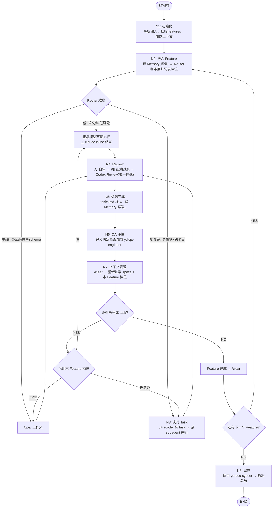

# Feature 开发工作流

```mermaid
flowchart TD
    START([START]) --> N1

    N1["N1: 初始化<br/>解析输入、扫描 features、加载上下文"]
    N1 --> N2

    N2["N2: 进入 Feature<br/>读 Memory(读端) → Router 判难度并记录档位"]
    N2 --> ROUTER{Router 难度}

    ROUTER -->|低: 单文件/低风险| LOW
    ROUTER -->|中/高: 多task/共享schema| GOAL
    ROUTER -->|极复杂: 多模块+跨项目| N3

    LOW["正常模型直接执行<br/>主 claude inline 做完"]
    GOAL["/goal 工作流"]
    N3["N3: 执行 Task<br/>ultracode: 拆 task → 派 subagent 并行"]

    LOW --> N4
    GOAL --> N4
    N3 --> N4

    N4["N4: Review<br/>AI 自审 → PII 出站过滤 → Codex Review(唯一仲裁)"]
    N4 --> N5

    N5["N5: 标记完成<br/>tasks.md 标 x、写 Memory(写端)"]
    N5 --> N6

    N6["N6: QA 评估<br/>评分决定是否触发 yd-qa-engineer"]
    N6 --> N7

    N7["N7: 上下文管理<br/>/clear → 重新加载 specs + 本 Feature 档位"]
    N7 --> MORE_TASK{还有未完成 task?}

    MORE_TASK -->|YES| ROUTE_KEEP{沿用本 Feature 档位}
    ROUTE_KEEP -->|低| LOW
    ROUTE_KEEP -->|中/高| GOAL
    ROUTE_KEEP -->|极复杂| N3

    MORE_TASK -->|NO| FEATURE_DONE["Feature 完成 → /clear"]

    FEATURE_DONE --> MORE_FEATURE{还有下一个 Feature?}
    MORE_FEATURE -->|YES| N2
    MORE_FEATURE -->|NO| N8

    N8["N8: 完成<br/>调用 yd-doc-syncer → 输出总结"]
    N8 --> END([END])
```